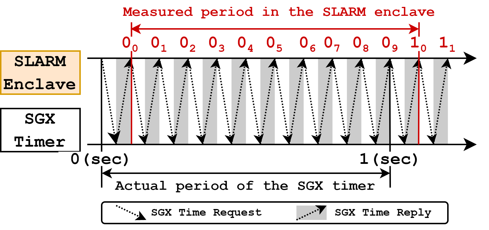
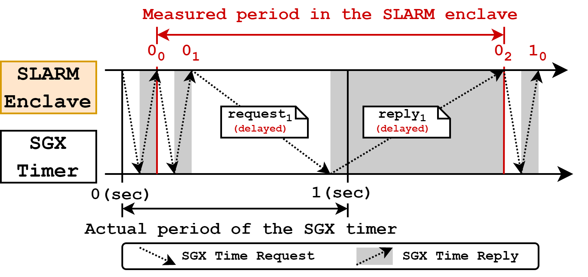
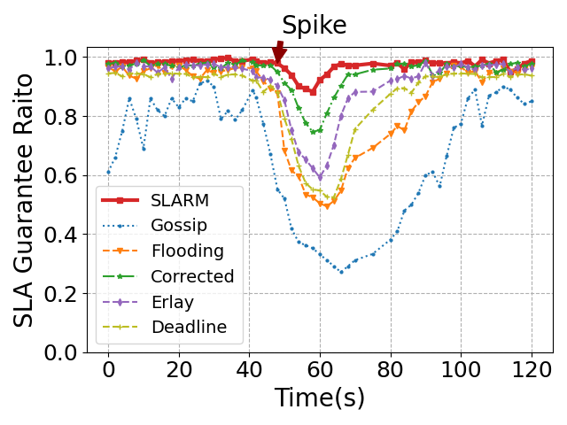
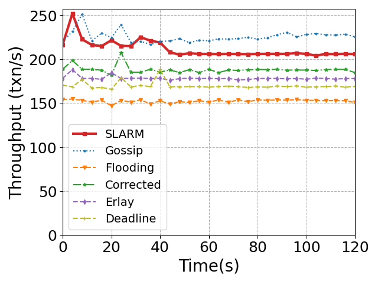

Important Note!! SLARM is still under development.

# Table of Contents
- [SLARM's Fine-grained Trusted Timer](#slarms-fine-grained-trusted-timer)
- [Q&A](#qa)
- [References in Paper](#references-in-paper)
- [New References](#new-references)

# SLARM's Fine-grained Trusted Timer

Intel SGX provides a hardware-protected trusted timer (in short, SGX timer) for
enclave programs [21]. Programs running in SGX enclaves can request the local
trusted timestamp by API call `sgx_get_trusted_time()`. The time source of the
SGX timer is hardware-protected and transfers the time packets to enclave
programs over a secure channel, so the malicious node cannot modify the trusted
time packets [37].

However, the SGX timer cannot meet the requirements of SLARM due to two
limitations. First, the SGX timer is coarse-grained, which provides only
second-level resolution, while the elapsed time of an SLA transaction on a node
can be as low as tens of milliseconds. Second, a malicious node can damage the
SGX timer's accuracy. For instance, although the node cannot tamper with the SGX
time source (hardware protected) and the time packet contents (transferred via
the secure channel), the node can still delay the time packets, distorting the
time for enclave programs (**Figure 2**). We adopted the fine-grained trusted time
architecture of TimeSeal [37] to overcome these two limitations.

SLARM's fine-grained trusted timer (same as TimeSeal [37]) is built upon the
hardware-protected SGX timer. We spawn two timer threads in each node's enclave:
a *timer thread* continuously pulls the hardware-protected SGX timer ticks
(second-level), and a *counting thread* incrementing a variable that counts the
CPU cycles within each SGX timer tick. Nodes calculate the fine-grained trusted
timestamp `t` by, i.e., *t = SGXticks +
current_cpu_cycles/total_cpu_cycles_per_sec*, where *SGXticks* is the
hardware-protected SGX timer ticks.

## Security Analysis of SLARM's Trusted Timer

We now provide a detailed security analysis about how to handle attacks from the
adversary (i.e., the malicious node). The malicious node can conduct only (1)
*delay attacks* on the time packets transferred between the SGX time source and
the enclave, (2) *scheduling attacks* on the two timer threads, and (3) *CPU
frequency scaling attacks* to reduce the resolution of the counting thread [37].

**Detecting delay attack.** As shown in **Figure 1**, the *timer thread*
continuously pulls the SGX timer; because the SGX timer only provides
second-level resolution, the timer thread obtains ten repeated timestamps of `0
sec` (`0_0` ~ `0_9`) before obtaining the first `1 sec` timestamp (`1_0`). If
the malicious node delays `request_1` and `reply_1` (**Figure 2**), the measured
period of `0 sec` (`0_0` ~ `0_2`) in SLARM's enclave will be much longer than
the actual period of SGX timer. As a result, SLARM calculates wrong elapsed time
for SLA transactions.

    
     
    
 Figure 1: No delay attacks on the SGX time packets.

    
     
    
 Figure 2: Delay attacks on the SGX time packets.

Detection of the delay attacks relies on the intuition that the number of
repeated timestamps per SGX timer tick (second-level) shows large variations
under delay attacks. Request latency of the API call `sgx_get_trusted_time()` is
stable without attacks [47], so the number of repeated timestamps also
concentrates around its mean value. In **Figure 2**, the timer thread only
obtains three repeated timestamps (`0_0` ~ `0_2`) of `0 sec` under the delay
attack, much fewer than the expected value (i.e., 10 repeated timestamps of `0
sec` in **Figure 1**). If the number of repeated timestamps between two adjacent
SGX time ticks is fewer than the expected value, a node can determine itself is
under the delay attack and *kicks-out* itself from SLARM's P2P network. When a
node ticks-out itself from SLARM's P2P network, the node stops processing all
incoming messages and multicasts all transactions waiting in the transaction
queue. Thus, the node's peers can no longer receive any RTT response from this
node, and drop this node from their peer lists.

**Detecting scheduling attack.** The malicious OS can schedule out the *timer
thread* and the *counting thread* running in the SGX enclave at any instant. We
let each node in SLARM detect this scheduling attack and kick-out itself from
SLARM's P2P network when the attacks occur.

If the malicious node schedules out the counting thread, the number of counted
CPU cycles per SGX timer tick is reduced, making the counting thread downgrade
the trusted timer's resolution to seconds. If the number of counted CPU cycles
per second falls below a specified threshold (e.g., 1000 CPU cycles per second
to provide millisecond-level resolution), the node kicks-out itself from SLARM's
P2P network. If the malicious node schedules out the timer thread (or both of
the two threads), the repeated SGX timestamps per second will reduce, which is
the same as the delay attack.

**Detecting CPU frequency attack.** A privileged adversary (e.g., the malicious
host) can manipulate the power management feature of modern Intel CPUs and
reduce the CPU frequency. As the SGX timer is backed up with its own battery,
the SGX timer's frequency is not affected by the node host's power management
[37]. Reducing the CPU frequency leads to fewer CPU cycles per second counted by
the counting thread, achieving the same effect as the scheduling attack on the
counting thread.

Overall, by adopting the fine-grained trusted timer of TimeSeal [37], SLARM can
measure the trustworthy elapsed time of transactions on nodes and during
node-to-node disseminations, even with attacks from the adversary. 

# Q&A

<!-- **1 Why we didn't adopt a structured network, which can provide even lower
bandwidth consumption and convergence latency?**

> SLARM, as well as typical blockchain message multicast protocols, is
> unstructured. The routing decisions are made independently by every P2P node
> based on their local views. This form of data multicast protocol is
> reliable, but not the most efficient, as it results in redundant transmissions
> and may lead to a large number of message collisions. 
>
> This is not the case with structured multicast protocols. For instance, a
> structured protocol can organize P2P nodes into a tree topology, and transmit
> messages over the tree structure (parent send to children). Structured
> disseminate protocols can reduce redundant transmissions and achieve lower
> bandwidth consumption in normal cases, but, on the other hand, they are very
> fragile (e.g., partition) in the presence of failures, lacking the natural
> resilience of unstructured protocols. 
> 
> A blockchain network is consist of heterogeneous nodes with diverse network
> conditions. Nodes can leave or join the network without asking for permission.
> Some critical applications such as trading are embedded with blockchain,
> making blockchain susceptible to various attacks. Therefore, the network
> topology of SLARM is still unstructured. -->

**1 Why did we limit each blockchain node's available bandwidth?**

> We limited the available bandwidth of each node for two reasons. First, in a
> Internet-wide blockchain system, nodes are deployed across several ISPs. The
> ISPs' maximum available bandwidth differs by area and connection type. For
> example, Comcast may offer connection speeds up to 50Mbps in some areas,
> whereas DSL services may offer a 20Mbps connection speed in another [new 1].
> To simulate commodity network links, we capped the bandwidth for each blockchain
> node to 20-30 Mbps, which is the same as Algorand [59]. Second, only
> increasing the nodes' bandwidth cannot significantly improve the SLA
> satisfaction rate. As shown in **Figure 3** below, we increase the bandwidth
> of all nodes to 100Mbps, the Ethereum-clique blockchain with five baseline P2P
> multicast protocols can achieve more stable throughputs under transaction
> spikes. However, their SLA satisfaction rates are still low. 

**2 Can existing transaction multicast protocols achieve higher SLA satisfaction
rates and throughputs with large network bandwidth?**

    
    
     
    
 Figure 3: SLA guarantee for SLA transactions and throughput for all transactions. (100Mbps bandwidth, 5000 nodes).  

> **Figure 3:** SLA guarantees for SLA transactions and throughputs for all
>transactions of the online trading application. 
>
> **New setting:** 100Mbps bandwidth, 5000 nodes.
> 
>**Experiment (same with paper):** At 0s, SLA (70%, all invoke smart contracts)
>and non-SLA (30%) >transactions are submitted to the network until peak
>throughput; at 48s, a >spike of 200 txn/s SLA transactions lasts for 5s. 
> 
>**Explanation:** With higher node bandwidth, the throughputs of all protocols
>are more stable under transaction spikes. However, the SLA satisfaction rates
>of existing P2P multicast protocols are still lower than SLARM. This is because
>existing protocols disseminate transactions in a FIFO manner, unaware of the
>priorities of transactions. Many non-SLA transactions are proposed before SLA
>transactions, SLA-stringent transactions are deferred by other transactions.

<!-- 3 For enforcing in-order execution for SLA transactions, why not clients submit
the next SLA transaction after all previous transactions have been committed? 

> Transactions will be committed to different blocks, which may incur too much
> latency to confirm all transactions.  -->

<!-- 4. How about only use transactions' timestamp rather than remaining deadline during multicast? -->

# References in Paper
[33] Anwar, Fatima M., et al. "Securing Time in Untrusted Operating Systems with TimeSeal." 2019 IEEE Real-Time Systems Symposium (RTSS). IEEE, 2019.  
[52] Liang, Hongliang, et al. "Aurora: Providing trusted system services for enclaves on an untrusted system." arXiv preprint arXiv:1802.03530 (2018).  
[59] Algorand: Scaling Byzantine Agreements for Cryptocurrencies, SOSP '17.

# New References
[new 1] https://tinyurl.com/yd8fsfb6  
